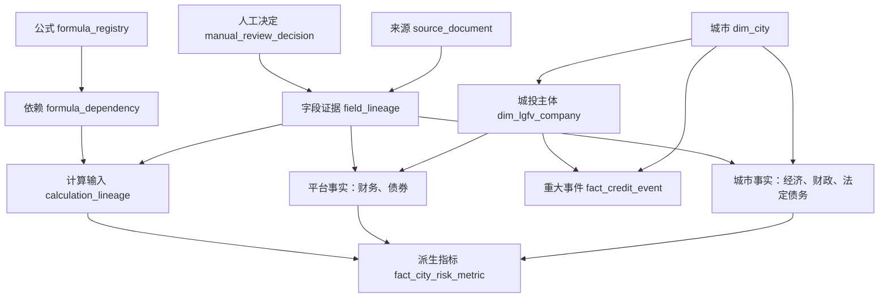
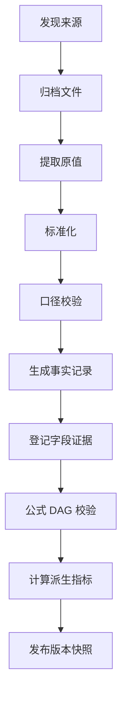
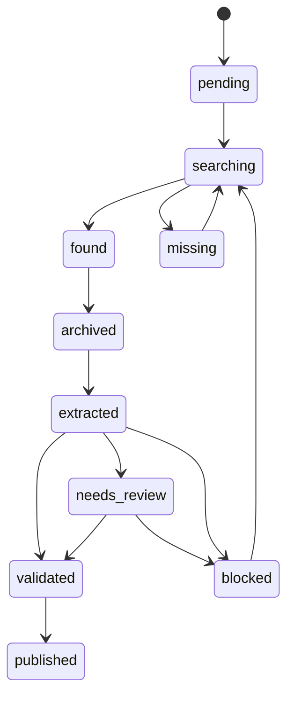

# 中国地级市城投债研究：数据采集方案与字段设计

> 版本：v1.2  
> 编制日期：2026-07-31  
> 研究对象：地级市经济财政、地方政府法定债务、城投平台及城投债  
> 推荐首期基准：2024 年正式/决算口径；2025 年作为滚动快报层单独保存  
> 适用对象：研究人员、数据采集 Agent、数据复核 Agent、指标计算 Agent

## 零、文档使用方式与 Agent 执行约束

本文件既是研究口径说明，也是后续 Agent 工作的执行规范。Agent 不得仅根据字段名称猜测口径，而应按本文件规定的对象、粒度、状态、来源和校验规则生成数据。

### 0.1 规范用语

| 用语 | 含义 |
|---|---|
| **必须** | 强制要求；不满足时不得进入正式主表 |
| **应当** | 默认执行；仅在有明确、可记录的理由时允许例外 |
| **可以** | 可选增强项，不影响最小可用数据集验收 |
| **禁止** | 任何 Agent 或人工处理均不得执行 |

### 0.2 Agent 的基本工作原则

1. **先确定对象和粒度，再采集数值**：先确认城市、年度、行政范围、报告期和报表范围。
2. **先保存原始证据，再做标准化**：原始网页、附件、标题、URL、原值和位置不得因后续换算而丢失。
3. **直接披露值、计算值和估算值分开**：三者分别标记为 `disclosed`、`calculated`、`estimated`。
4. **一值一证据链**：事实表中每个非空业务字段必须至少对应一条 `field_lineage`。
5. **计算值必须可反向重算**：必须记录公式版本及全部输入记录，不能只保存最终结果。
6. **不猜测缺失值**：未找到、未披露或无法确认口径时保存为 `null`，并记录原因；禁止填 0。
7. **不静默覆盖**：新披露、修订或决算数据以新版本写入，旧版本保留。
8. **不跨口径运算**：行政范围、统计时点、币种、单位或合并范围不一致时，禁止自动计算比率或加总。
9. **模型判断不冒充事实**：城投认定、集团去重、来源选择和估算必须保留规则版本、置信度和理由。
10. **失败也要留痕**：链接失效、验证码、附件缺失、OCR 失败和口径无法识别均进入 `collection_status`。
11. **人工纠错不改写原始证据**：人工只能通过独立复核决定记录修正值、理由和审批状态；不得覆盖 `raw_value`、原始文件或既有 Agent 输出。
12. **禁止二进制浮点进入正式数值链**：金额、比率和计算输入必须使用数据库定点数及 Python `Decimal` 等十进制类型；不得以 `float`/`double` 参与正式计算后再写库。
13. **公式先验必须无环**：任何派生指标执行前必须验证公式依赖图为有向无环图（DAG）；自依赖或循环依赖一律阻断。

### 0.3 Agent 的标准输入与输出

采集任务的最小输入应包括：

```yaml
city_id: CN-210200
metric_year: 2025
module: gov_debt
expected_geo_scope: prefecture_whole
preferred_data_status:
  - final
  - audited
  - revised
  - preliminary
```

最小输出不是一个孤立数字，而是一组相互关联的记录：

```yaml
source_document: 原始网页或文件及其归档信息
fact_record: 标准化后的业务值
field_lineage: 每个业务字段对应的原始位置、原值和换算
calculation_lineage: 计算值的公式版本及输入记录
collection_status: 任务状态、异常和下一步动作
```

若 Agent 只能输出数值而不能输出来源和口径，该结果只能进入暂存层，不得进入正式主表。

### 0.4 v1.2 架构审查决定

本版对外部审查建议逐条判断如下。表中的“调整后采纳”表示接受问题判断，但不照搬可能破坏现有语义或物理模型的实现方式。

| 建议 | 结论 | v1.2 处理 | 判断理由 |
|---|---|---|---|
| 人工覆写与 `manual_corrected` | 调整后采纳 | 新增 `manual_review_decision`；`value_origin` 仍保留来源性质，人工修正作为处理/复核状态 | “人工修正”不是数据来源。若直接改 `field_lineage.normalized_value`，反而会破坏机器解析与人工决定的分离 |
| 金额统一 `DECIMAL(18,4)` | 调整后采纳 | 所有“亿元”金额使用 `AMOUNT_100M=DECIMAL(18,4)`；元、比率、置信度使用各自数值域；Agent 端强制十进制运算 | 定点数可以避免二进制浮点误差，但误差与“并发写入”没有直接因果关系；并发一致性应由事务和唯一约束处理 |
| SCD 双时间轴 | 调整后采纳 | `dim_city`、`dim_lgfv_company` 同时保存业务有效区间和系统有效区间 | 单个 `system_record_time` 只能表示写入时点，不能完整回答“系统在某时点认为何者有效”；严格双时间需要系统起止区间 |
| 估值收益率、隐含评级、借新还旧比例 | 调整后采纳 | 纳入债券快照字段并增加来源、方法、时点和可计算性约束；用途拆分可进入子表 | 三项指标有用，但都不是稳定静态属性，缺少快照日、估值源、评级方法或明确分母时不得入正式值 |
| array 改 JSON/JSONB 或字典表 | 调整后采纳 | 历史名称、平台职能、特殊条款拆为一对多/多对多关系表；JSONB 仅保存不可稳定拆分的原始载荷 | JSONB 仍是复合值，并不会自动恢复 1NF，也难以实施枚举、外键和有效期约束 |
| 新增重大信用与化债事件表 | 采纳 | 新增 `fact_credit_event` | 可补足非标逾期、失信、违约、化债试点、特殊再融资债等离散事件，且不要求伪造隐性债务精确余额 |
| 明确 `NOT NULL` | 采纳 | 增加物理约束矩阵，并按表粒度定义必填键 | `city_id`、`metric_year` 等并非对所有事实表都适用，必须按表设约束，不能把一组公共字段机械套到所有表 |
| 归档路径使用对象存储 URI | 调整后采纳 | 主字段改为后端无关的 `archive_uri`，限定 URI 方案和对象键规范；不锁死 S3 | `s3://` 是一种实现，不是跨所有云平台的唯一标准；跨环境一致性来自规范化 URI 和存储配置 |
| 公式 DAG 校验 | 采纳 | 新增公式注册表、依赖边表、拓扑排序和循环阻断规则 | 该问题准确名称是“循环依赖/无限递归”，不是数据库死锁；但必须在计算前阻断 |

## 一、结论：改成地级市口径会更好

如果研究目标是建立全国可比的城投债风险数据库，地级市比县级行政区更适合作为第一阶段主口径。

| 比较维度 | 县级口径 | 地级市口径 | 判断 |
|---|---|---|---|
| GDP 可得性 | 较高，但网站分散、修订难追踪 | 高，统计公报和年鉴较完整 | 地级市更优 |
| 财政数据 | 预算、决算文件分散，格式不统一 | 市级和省级汇总表较集中 | 地级市更优 |
| 法定债务 | 原则上公开，实际缺失较多 | 省财政厅经常按地市列示限额和余额 | 地级市明显更优 |
| 城投主体覆盖 | 未发债县级平台透明度低 | 市级平台和主要区县平台多有公开债券 | 地级市更优 |
| 行政口径冲突 | 开发区、功能区、县市区重叠较多 | 冲突仍存在，但可在市级汇总层处理 | 地级市更易治理 |
| 全国采集成本 | 高 | 中等 | 地级市更适合先建库 |
| 风险颗粒度 | 可识别县域差异 | 可能掩盖区县分化 | 县级适合第二阶段下钻 |

建议采用“地级市主库 + 重点区县下钻库”：

1. 先建立全国地级市年度面板，用于横向比较、筛选和预警；
2. 对债务率高、财政弱、短期到期压力大或利差异常的城市，再采集区县级数据；
3. 不追求把不能公开取得的隐性债务包装成精确数值，而是分别展示法定债务、城投债券余额和城投有息债务。

## 二、研究范围与样本边界

### 2.1 推荐样本

采用双层样本，而不是把行政单元数量写死：

| 样本层 | 纳入对象 | 用途 |
|---|---|---|
| 核心样本 | 法定地级市 | 主排名、主模型、跨城市比较 |
| 扩展样本 | 自治州、地区、盟 | 补充全国地级行政单元覆盖 |
| 单列观察 | 直辖市 | 可研究，但不与普通地级市直接排名 |
| 暂不纳入 | 省直辖县级行政单位、功能区、开发区 | 第二阶段下钻或专题研究 |

行政区划应按研究年度建立版本表。不得长期硬编码一个城市名单，因为撤地设市、区划代码及管辖关系可能变化。国家统计局说明，统计用区划代码以行政区划代码为基础，并服务于统计调查；两者用途并不完全相同，应分别保留。[国家统计局：统计制度及分类标准](https://www.stats.gov.cn/hd/cjwtjd/202302/t20230207_1902279.html)

### 2.2 地理口径

每一条 GDP、财政或债务数据都必须标记 `geo_scope`：

| 枚举值 | 中文含义 | 典型使用场景 |
|---|---|---|
| `prefecture_whole` | 全市口径，含所辖区县 | GDP、全市财政、全市法定债务 |
| `municipal_level` | 市本级 | 市本级预算、债务和支出 |
| `urban_districts` | 市辖区口径 | 部分城市统计年鉴 |
| `functional_zone` | 开发区、功能区口径 | 金普新区、高新区等专题数据 |
| `unknown_scope` | 原文未说明 | 暂存但禁止参与核心比率计算 |

主库默认使用 `prefecture_whole`。同一指标同时披露“全市”和“市本级”时，两条都保存，不能互相覆盖。

### 2.3 时间口径

建议分三层保存：

| 数据层 | 推荐年度 | 状态 | 用途 |
|---|---:|---|---|
| 主基准层 | 2024 | 正式、决算或审计数优先 | 全国可比分析 |
| 滚动快报层 | 2025 | 初步核算、预算执行、快报 | 最新跟踪 |
| 历史回填层 | 2018—2023 | 按年回填 | 周期、趋势和回测 |

2025 年数据不得覆盖 2024 年正式数据，也不得将“初步核算”“预计执行数”“快报数”标成决算数。

## 三、四类债务口径及其勾稽关系

### 3.1 四类债务口径

本研究必须分别保存以下四类债务。它们不是四个可以直接相加的并列科目。

| 口径 | 定义 | 能否公开完整取得 | 数据库处理 |
|---|---|---:|---|
| 地方政府法定债务 | 一般债务余额 + 专项债务余额 | 较高 | 进入 `fact_city_gov_debt` |
| 城投债券余额 | 被认定为城投平台的企业在快照日尚未偿还的公开债券本金 | 较高 | 逐券进入 `fact_bond` 后汇总 |
| 城投有息债务 | 城投企业需要支付利息的借款、债券、租赁及其他融资 | 中等 | 从合并财报和附注提取至 `fact_lgfv_financial` |
| 隐性债务 | 政府负有偿还责任、但未纳入法定政府债务限额管理的融资 | 低 | 不做伪精确估计；仅记录有可靠依据的披露或事件 |

财政部公开办法明确，地方政府债务包括一般债务和专项债务，县级以上财政部门应公开债务限额、余额以及发行、偿还等信息。[财政部《地方政府债务信息公开办法（试行）》](https://www.mof.gov.cn/gkml/caizhengwengao/wg201901/wg2019011/201905/t20190506_3245939.htm)

### 3.2 四类债务来自两个分类维度

四类债务之所以容易被误加，是因为它们回答的是不同问题：

| 分类维度 | 包含的债务 | 回答的问题 |
|---|---|---|
| 政府偿债责任维度 | 法定政府债务、隐性债务 | 该债务是否由地方政府依法或事实上承担偿还责任？ |
| 城投企业融资维度 | 城投债券余额、城投有息债务 | 城投企业通过何种工具融资、在统计时点尚欠多少？ |

因此，一笔城投银行贷款可能同时属于“城投有息债务”，并在监管认定下属于“隐性债务”。前者描述债务人和融资工具，后者描述政府责任性质。

### 3.3 法定政府债务的内部勾稽

在同一城市、同一行政范围、同一统计时点和同一数据状态下：

\[
\text{法定政府债务余额}
=
\text{一般债务余额}
+
\text{专项债务余额}
\]

\[
\text{法定政府债务限额}
=
\text{一般债务限额}
+
\text{专项债务限额}
\]

同时原则上应满足：

\[
\text{法定政府债务余额}
\leq
\text{法定政府债务限额}
\]

Agent 执行规则：

1. 若来源直接披露总额和分项，分别保存，并校验总额是否等于分项之和；
2. 若来源只披露分项，总额可以计算，但 `value_origin` 必须为 `calculated`；
3. 若来源只披露总额，不得反推一般债务和专项债务；
4. 因亿元取整产生的差异必须使用固定容差，例如绝对值不超过 `0.2` 亿元或相对误差不超过 `0.05%`，并记录 `tolerance_rule`；
5. 超过容差时不得自动修正，应进入冲突组并触发人工复核。

### 3.4 城投债券余额与城投有息债务的勾稽

在经济义务层面：

\[
\text{城投债券余额}
\subseteq
\text{城投有息债务}
\]

城投有息债务的统一基础公式为：

\[
\begin{aligned}
\text{城投有息债务}={}&
\text{短期借款}
+\text{一年内到期的有息负债}\\
&+\text{长期借款}
+\text{应付债券}\\
&+\text{租赁负债中的有息部分}
+\text{其他明确计息融资}
\end{aligned}
\]

但是，市场统计的城投债券余额与财务报表中的“应付债券”不能被要求机械相等，常见差异包括：

- 债券余额通常按剩余本金统计，财报可能按摊余成本或账面价值统计；
- 一年内到期债券可能重分类到“一年内到期的非流动负债”；
- 合并报表包含子公司债券，单体报表只反映本公司；
- 境外债、资产证券化、私募品种和永续类工具的纳入口径不同；
- 债券快照日与财务报告期末不一致；
- 提前偿还、回售、债券购回或发行费用摊销导致差异。

因此，Agent 只能在以下条件全部一致时执行债券—财报勾稽：

```yaml
same_company_scope: true
same_group_scope: true
same_period_end: true
same_instrument_rule_version: true
same_currency_basis: true
```

若不能满足，应输出差异及原因，不得强行将二者调整为相等。

### 3.5 隐性债务与另外三类债务的关系

隐性债务是一种政府偿债责任认定，不是一种融资工具。其关系应按以下规则理解：

1. **法定债务与隐性债务**：在同一认定时点原则上互斥；某笔隐性债务被置换为法定债务后，原债务应同步清偿或核销，跨期分析必须防止新旧重复。
2. **隐性债务与城投有息债务**：存在未知交集，且县市级完整交集通常不公开。
3. **城投有息债务不等于隐性债务**：正常商业化经营形成、由企业自身偿还的债务，不应仅因发行人为城投而认定为政府隐性债务。
4. **隐性债务不一定都在城投企业内**：也可能通过事业单位、政府购买服务、PPP、政府投资基金等安排形成。
5. **特殊再融资债券**：它属于法定政府债券融资工具；若用于置换存量隐性债务，研究中必须按转换时点处理，不得将置换前隐性债务与置换后法定债务同时计入同一期总量。

可用集合关系表示为：

\[
\text{隐性债务}\cap\text{城投有息债务}
=
\text{未知且通常不公开的部分}
\]

因此，禁止使用以下公式：

\[
\text{法定债务}
+
\text{城投债券余额}
+
\text{城投有息债务}
+
\text{隐性债务}
\]

该公式至少重复计算了城投债券，并可能再次重复计算隐性债务与城投有息债务的交集。

### 3.6 研究中允许使用的观察口径

| 观察口径 | 公式 | 用途 | 限制 |
|---|---|---|---|
| 政府法定负债 | 法定政府债务 | 最确定、最可比的政府债务观察 | 不包含隐性债务 |
| 公开市场压力 | 城投债券余额 | 观察公开债再融资和到期压力 | 不代表城投全部债务 |
| 广义融资压力 | 法定债务 + 去重后城投有息债务 | 分析区域公共部门相关融资压力 | 是研究指标，不等于政府债务 |
| 政府实际责任 | 法定债务 + 隐性债务 | 理论上的政府责任口径 | 县市级隐性债务无法公开完整取得 |

“广义融资压力”允许将法定债务与去重后的城投有息债务相加，是因为它刻画的是区域融资压力，而不是政府会计负债。指标名称、公式和免责声明必须同时展示。

### 3.7 禁止混用的概念

- “城投债券余额”不等于“城投有息债务”；
- “地方政府法定债务”不等于“地方政府全部实际负担”；
- 官方“债务率”可能以综合财力为分母，不一定等于债务余额/GDP；
- 研究中计算的“法定债务/GDP”必须命名为分析指标，不得标注为官方债务率；
- 城投有息债务与法定债务可以构造“广义债务压力指标”，但必须明确这是研究口径，不是官方债务余额；
- 任何包含隐性债务的城市级精确总量，若没有公开原始依据，只能标记为估算、区间或未知，不得标记为官方披露值。

## 四、总体数据模型：对象、记录、证据与计算

### 4.1 为什么不能全部放在一张 Excel 表

本项目同时处理“城市是谁”“某年披露了什么”“数字来自哪里”“数字如何计算”四类问题。如果全部放在一张宽表中，会产生以下风险：

- 城市改名或区划调整后，历史记录无法正确归属；
- 一家城投有多期财报、多只债券，城市行会被重复；
- 同一字段可能来自不同报告，单个 `source_url` 无法说明每个值的出处；
- 初步数、决算数和修订数互相覆盖；
- 计算指标无法追溯到输入值及其原始证据；
- 母子公司合并范围不清时容易重复加总。

因此，数据模型必须把身份、事实、证据、计算和任务状态分开保存。

### 4.2 四类表分别承担什么任务

| 表类型 | 命名前缀/示例 | 作用 | 通俗理解 |
|---|---|---|---|
| 维度表 | `dim_city`、`dim_lgfv_company` | 记录研究对象是谁，以及身份何时有效 | 名册、身份证 |
| 事实表 | `fact_city_economy`、`fact_bond`、`fact_credit_event` | 记录某对象在某年、某时点的业务数值或重大事件 | 年报、流水、余额、事件台账 |
| 证据表 | `source_document`、`field_lineage` | 证明每个值来自哪份文件、哪个位置 | 档案、证据目录 |
| 计算与治理表 | `fact_city_risk_metric`、`calculation_lineage`、`formula_registry`、`manual_review_decision`、`collection_status` | 保存派生结果、输入链、公式、人工决定和采集状态 | 计算底稿、复核记录、任务台账 |

### 4.3 每张表的一行代表什么

“一行代表什么”称为数据粒度。Agent 在写入前必须先确认粒度；粒度不清时不得写入正式表。

| 表 | 一行代表的对象与时点 | 建议唯一键 |
|---|---|---|
| `dim_city` | 一个城市在某一业务有效期、系统有效期内的身份版本 | `city_id + valid_from + system_valid_from` |
| `fact_city_economy` | 某城市、某年度、某行政范围、某数据状态的一组经济值 | `city_id + metric_year + geo_scope + data_status + version_no` |
| `fact_city_fiscal` | 某城市、某年度、某行政范围、某数据状态的一组财政值 | 同上 |
| `fact_city_gov_debt` | 某城市、某年末、某行政范围、某口径版本的法定债务 | `city_id + period_end + geo_scope + data_status + version_no` |
| `dim_lgfv_company` | 一家城投企业在某一业务有效期、系统有效期内的身份版本 | `company_id + valid_from + system_valid_from` |
| `fact_lgfv_financial` | 某企业、某报告期、合并或母公司口径的一套财务值 | `company_id + period_end + statement_scope + version_no` |
| `fact_bond` | 某只债券在某一快照日的余额和状态 | `bond_id + snapshot_date` |
| `fact_credit_event` | 某对象在某日发生或被披露的一项信用恶化、化债或政策支持事件 | `event_id` |
| `source_document` | 一份网页、PDF、Excel 或报告的一个内容版本 | `source_doc_id`；文件去重辅助使用 `content_hash_sha256` |
| `field_lineage` | 某个目标记录的某个字段与一处原始证据之间的关系 | `lineage_id` |
| `manual_review_decision` | 某目标字段的一次人工选择、纠错、驳回或冲突处置决定 | `decision_id` |
| `fact_city_risk_metric` | 某城市、某年度、某行政范围、某公式版本的一个派生指标 | `city_id + metric_year + metric_code + formula_version` |
| `calculation_lineage` | 某个计算结果与一个输入字段之间的关系 | `calculation_id + input_order` |
| `formula_registry` | 某项公式一个不可变版本的定义和审批状态 | `formula_code + formula_version` |
| `formula_dependency` | 某版公式对另一个公式或原子字段的一条依赖边 | `formula_code + formula_version + dependency_order` |
| `collection_status` | 某城市、年度、数据模块的一次采集任务状态 | `task_id` |

### 4.4 表之间如何连接



关系说明：

1. `city_id` 把城市身份与经济、财政、法定债务、城投主体和风险指标连接起来；
2. `company_id` 把城投主体与财务报表、债券连接起来；
3. `source_doc_id` 把原始文件与字段证据连接起来；
4. `target_record_id + target_field` 把字段证据精确指向事实表中的一个值；
5. `calculation_id` 把计算结果、公式版本和全部输入字段连接起来；
6. 派生指标只读取事实表，不得反向覆盖事实表。

### 4.5 推荐的核心表与辅助表

十张核心业务与证据表：

1. `dim_city`：城市与区划主表；
2. `fact_city_economy`：城市经济人口年度表；
3. `fact_city_fiscal`：城市财政年度表；
4. `fact_city_gov_debt`：法定政府债务年度表；
5. `dim_lgfv_company`：城投主体主表；
6. `fact_lgfv_financial`：城投财务年度表；
7. `fact_bond`：债券逐券明细表；
8. `fact_credit_event`：重大信用与化债事件表；
9. `source_document`：原始来源文件表；
10. `field_lineage`：字段级证据与版本表。

另设计算、关系和治理表：

1. `fact_city_risk_metric`：派生风险指标；
2. `calculation_lineage`：公式、计算结果与输入字段的映射；
3. `formula_registry`、`formula_dependency`：公式版本及依赖图；
4. `manual_review_decision`：人工选择、纠错及审批历史；
5. `company_name_history`、`bridge_company_function`：主体历史名称与平台职能关系；
6. `bond_special_term`、`bond_proceeds_allocation`：债券特殊条款与用途分配；
7. `collection_status`：采集覆盖率、失败原因和后续动作。

### 4.6 一个数值如何在模型中流转

以“大连市 2025 年一般债务余额 1,680.9 亿元”为例：

1. `dim_city` 中确认大连市 `city_id=CN-210200`；
2. `source_document` 保存网页标题、发布机构、发布日期、入口 URL、HTML 内容哈希和归档位置；
3. `fact_city_gov_debt` 保存 `general_debt_balance_100m=1680.9`；
4. `field_lineage` 指向 HTML 表格“大连市”行、“一般债务余额”列，并保存原始值 `1680.9` 和单位“亿元”；
5. 专项债务余额 1,880.3 亿元按同样方式另建证据；
6. 法定债务总余额 3,561.2 亿元若非来源直接披露，则标记为 `calculated`；
7. `calculation_lineage` 记录公式 `GENERAL_DEBT_BALANCE + SPECIAL_DEBT_BALANCE`，并连接两条输入证据；
8. 后续法定债务/GDP 指标继续引用已验证的法定债务总额和 GDP 输入，不复制或改写原始值。

若人工发现 Agent 把 `1680.9` 误读为 `16809`，不得修改原 `field_lineage.raw_value` 或删除本次 Agent 输出。应新增 `manual_review_decision`，记录修正前值、修正后值、原因、复核人和审批状态；当前值视图只读取已批准的人工决定。

这样可以回答四个不同问题：

| 问题 | 查询对象 |
|---|---|
| 大连 2025 年一般债务余额是多少？ | `fact_city_gov_debt` |
| 这个数来自哪里？ | `field_lineage` → `source_document` |
| 3,561.2 亿元是披露值还是计算值？ | `value_origin` |
| 3,561.2 亿元由哪些输入计算？ | `calculation_lineage` |
| 数值是否被人工修正、为何修正？ | `manual_review_decision` |

### 4.7 Agent 的标准数据流



Agent 必须按顺序执行。特别禁止：

- 先计算指标、后补来源；
- 只保存网页 URL，不保存网页标题和取值位置；
- 用同一行的一个 `source_doc_id` 代替所有字段的 `field_lineage`；
- 在提取阶段把万元直接覆盖为亿元而不保留原始值；
- 为使勾稽通过而修改官方原值。

## 五、数据源及采集优先级

### 5.1 数据源矩阵

| 数据模块 | 一级来源 | 二级来源 | 补充来源 | 更新规律 |
|---|---|---|---|---|
| 行政区划 | 民政部门行政区划、国家统计局统计用区划 | 省民政厅 | 年鉴 | 每年或区划调整时 |
| GDP、人口、产业 | 地级市统计公报、统计年鉴 | 省统计年鉴、国家统计局城市资料 | 政府工作报告、商业库 | 次年一季度初步，之后修订 |
| 财政收支 | 市财政预算执行报告、财政决算 | 省财政厅分地区表 | 统计公报、政府工作报告 | 预算、调整预算、决算多版本 |
| 法定债务 | 省财政厅分地区限额余额表、市级债务附表 | 中国地方政府债券信息公开平台 | 地方债募集文件 | 年初快报、决算修订 |
| 城投主体 | 国资委名录、发行人募集说明书 | 工商登记、评级报告 | 商业数据库 | 主体变化时 |
| 城投财务 | 审计报告、债券年度报告 | 募集说明书、评级报告 | 商业数据库 | 年报一般在次年 4 月前后集中披露 |
| 债券明细 | 交易所、中国货币网、登记托管机构 | 发行人公告 | 商业数据库 | 持续更新 |
| 债券估值与隐含评级 | 依法可用的估值机构/指数发布方、交易场所 | 评级机构、发行人披露 | 商业数据库 | 交易日或供应商更新日；必须绑定快照日和方法版本 |
| 重大信用与化债事件 | 监管、司法、交易场所、政府财政部门、发行人正式公告 | 评级报告 | 媒体仅作线索 | 事件驱动，持续更新 |

国家统计局指出，地方统计机构官网和地方统计年鉴是获取地级市数据的主要渠道；省级和地级统计机构通常按年发布主要年度数据。[国家统计局：地方统计数据获取渠道](https://www.stats.gov.cn/hd/cjwtjd/202302/t20230207_1902282.html)

《中国城市统计年鉴》包含地级以上城市的人口、经济、公共服务和基础设施等资料，但部分指标可能是“市辖区”而不是“全市”，只能作为补充和交叉核验。[国家统计局：《中国城市统计年鉴》简介](https://www.stats.gov.cn/zs/tjwh/tjkw/tjzl/202302/t20230220_1913734.html)

债券与发行人财务披露可从[上海证券交易所公司债券公告](https://www.sse.com.cn/disclosure/bond/announcement/company/)和银行间市场披露渠道取得。交易商协会规则要求存续期企业在会计年度结束后四个月内披露上一年度报告。[交易商协会信息披露规则](https://www.nafmii.org.cn/zlgl/zlgz/hxgll/202312/P020231201504225239165.pdf)

### 5.2 来源等级

| 等级 | 定义 | 是否可作为最终值 |
|---|---|---:|
| A1 | 官方原始表格/报告，且经另一官方来源交叉核验 | 是 |
| A2 | 单一官方原始来源，口径明确 | 是 |
| B1 | 经审计财报、法定债券披露文件 | 是 |
| B2 | 评级报告、募集说明书中的转引数据 | 可以，但优先被审计数 |
| C | 政府工作报告、官方新闻稿、官方转载 | 暂用或补缺 |
| D | 商业数据库、媒体、研究报告 | 只作线索或交叉核验 |

冲突处理顺序为：正式决算/审计数 > 修订数 > 快报/预计执行数 > 工作报告 > 商业库。不能仅因某个来源日期更晚就自动取代口径更正式的数据。

## 六、公共治理字段、数值域与物理约束

下列字段构成事实表的公共治理元数据。不同事实表的业务粒度不同，因此不能把 `city_id`、`metric_year` 等机械设为所有表必填；物理层必须按 6.2 的表级矩阵实施。

| 字段名 | 类型 | 含义 |
|---|---|---|
| `record_id` | string | 记录唯一标识 |
| `city_id` | string | 内部稳定城市 ID |
| `metric_year` | int | 指标所属年度 |
| `period_end` | date | 数据截止日 |
| `geo_scope` | enum | 全市、市本级、市辖区、功能区等 |
| `data_status` | enum | `preliminary`、`budget`、`execution`、`final`、`audited`、`revised`、`estimated` |
| `currency` | string | 默认 `CNY` |
| `unit` | string | 元、万元、亿元、人、万人、% 等 |
| `publication_date` | date | 来源发布日期 |
| `source_doc_id` | string | 记录级主要来源文件 ID；仅用于快速定位，不能替代字段级证据 |
| `source_locator` | string | 页码、表名、行列或 HTML 段落 |
| `source_grade` | enum | A1、A2、B1、B2、C、D |
| `raw_text` | text | 原文摘录或原始单元格内容 |
| `extraction_method` | enum | `html`、`xlsx`、`pdf_text`、`ocr`、`manual`、`api` |
| `parse_confidence` | `CONFIDENCE` | 0—1，机器提取置信度 |
| `review_status` | enum | `unreviewed`、`machine_checked`、`human_checked`、`rejected` |
| `version_no` | int | 同口径记录版本号 |
| `is_current` | boolean | 当前有效版本 |
| `scope_match_flag` | boolean | 是否满足主库全市口径 |
| `lineage_complete_flag` | boolean | 所有非空业务字段是否均已建立字段证据或计算输入链 |
| `note` | text | 修订、区划、异常及判断说明 |

补充规则：

- 事实表是宽表时，同一行的不同字段可能来自不同文件，因此每个非空业务字段仍必须分别建立 `field_lineage`；
- `source_doc_id` 只表示该行的主要来源，不能证明整行所有字段都来自同一文件；
- `value_origin` 是字段级属性，保存在 `field_lineage`；同一事实行可以同时包含直接披露字段和计算字段；
- 字段的 `value_origin=calculated` 时必须存在 `calculation_id`；`value_origin=estimated` 时必须同时记录估算方法、假设和置信区间或不确定性说明；
- `lineage_complete_flag=false` 的记录只能进入暂存层。
- 人工修正不改变 `value_origin`：来源披露但被人工纠正解析错误的值，仍为 `disclosed`，同时通过 `manual_review_decision.decision_type=manual_corrected` 记录处理过程。

### 6.1 统一数值域

物理数据库应建立可复用的数值域或等价类型别名。字段表中出现逻辑类型 `decimal` 时，必须按字段含义映射到下表，而不是由开发者自行选择浮点类型。

| 数值域 | 物理类型 | 用途 | 精度解释 |
|---|---|---|---|
| `AMOUNT_100M` | `DECIMAL(18,4)` | 单位为亿元的 GDP、财政、债务、资产、债券金额 | 最小单位为 0.0001 亿元，即 1 万元 |
| `AMOUNT_YUAN` | `DECIMAL(24,2)` | 必须保留到元/分的金额 | 避免把元口径硬塞入亿元字段 |
| `RATE_PCT` | `DECIMAL(18,6)` | 利率、收益率、增速、占比，数值 35.6 表示 35.6% | 支持计算链保留中间精度 |
| `RATIO` | `DECIMAL(18,6)` | 倍数、比值，数值 0.356 表示 0.356 倍 | 与百分比字段分开 |
| `CONFIDENCE` | `DECIMAL(6,5)` | 0—1 置信度 | 必须满足 `0 <= value <= 1` |
| `YEAR_FRACTION` | `DECIMAL(10,4)` | 债券期限、平均剩余期限 | 单位为年 |

执行规则：

1. 正式链路禁止 `FLOAT`、`REAL`、`DOUBLE PRECISION`；临时模型可以使用，但入库前必须从原始字符串重新构造十进制值，不能从二进制浮点反转；
2. Python 使用 `Decimal(raw_string)`，Java 使用 `BigDecimal(raw_string)`，JavaScript 使用经过验证的十进制库；禁止 `Decimal(float_value)`；
3. 单位换算、舍入模式和舍入前值必须记录在 `normalization_rule`；默认不得提前把中间结果四舍五入；
4. `DECIMAL(18,4)` 解决的是存储和运算精度，不解决并发覆盖。并发一致性另由事务、版本号、唯一键和乐观锁控制；
5. 金额字段后缀必须与单位一致：`_100m` 只能使用 `AMOUNT_100M`，`_yuan` 只能使用 `AMOUNT_YUAN`。

### 6.2 `NOT NULL` 与主键最低约束

业务指标缺失应保留 `null`，不能为了通过非空校验填 0。`NOT NULL` 主要施加在身份键、粒度键、状态和治理字段上。

| 表 | 必须 `NOT NULL` 的最低字段 | 说明 |
|---|---|---|
| `dim_city` | `city_id`、`admin_code_6`、`city_name_cn`、`province_code`、`prefecture_type`、`valid_from`、`system_valid_from` | `valid_from` 是业务时间，`system_valid_from` 是系统时间 |
| `fact_city_economy` | `record_id`、`city_id`、`metric_year`、`period_end`、`geo_scope`、`data_status`、`currency`、`version_no`、`is_current`、`lineage_complete_flag` | GDP 等业务值允许缺失，但缺失原因须留痕 |
| `fact_city_fiscal` | 同 `fact_city_economy` | 不能因个别财政分项缺失阻断整行暂存 |
| `fact_city_gov_debt` | 同 `fact_city_economy` | 正式发布还须满足债务分项/总额校验 |
| `dim_lgfv_company` | `company_id`、`company_name`、`lgfv_flag`、`lgfv_rule_version`、`active_status`、`valid_from`、`system_valid_from` | 统一社会信用代码在历史主体中可能暂缺，暂不设全局非空 |
| `fact_lgfv_financial` | `record_id`、`company_id`、`period_end`、`statement_scope`、`data_status`、`currency`、`version_no` | `city_id` 通过主体有效期关系取得，不作为该表身份键 |
| `fact_bond` | `record_id`、`bond_id`、`company_id`、`snapshot_date`、`status`、`currency`、`version_no` | 市场估值字段非空时还必须有估值源和方法版本 |
| `fact_credit_event` | `event_id`、`subject_type`、`subject_id`、`event_type`、`event_date`、`event_date_precision`、`event_status`、`source_doc_id` | 未确认事件只能进暂存层，不得伪设日期 |
| `source_document` | `source_doc_id`、`publisher`、`document_title`、`mime_type`、`downloaded_at`、`content_hash_sha256`、`archive_uri`、`access_status` | 只有已归档内容才能进入正式来源表 |
| `field_lineage` | `lineage_id`、`target_table`、`target_record_id`、`target_field`、`value_origin` | `source_doc_id` 对计算值可空，但 `calculation_id` 必填 |
| `manual_review_decision` | `decision_id`、`target_table`、`target_record_id`、`target_field`、`decision_type`、`override_reason`、`reviewer_id`、`reviewed_at`、`approval_status` | 只有 `approved` 决定可以影响当前值视图 |
| `calculation_lineage` | `calculation_id`、`output_table`、`output_record_id`、`output_field`、`formula_code`、`formula_version`、`input_order`、`input_table`、`input_record_id`、`input_field` | 一个输入一行，禁止把输入 ID 拼成字符串 |

数据库还必须建立：主键/唯一键、外键、枚举 `CHECK`、`is_current` 部分唯一索引，以及同一业务键下有效期不得重叠的约束或测试。

### 6.3 维度表双时间轴

`dim_city` 与 `dim_lgfv_company` 使用双时间（bitemporal）管理：

| 时间轴 | 字段 | 回答的问题 |
|---|---|---|
| 业务有效时间 | `valid_from`、`valid_to` | 城市区划或企业归属在现实世界何时生效？ |
| 系统有效时间 | `system_valid_from`、`system_valid_to` | 数据库在何时开始、停止认为这一版本有效？ |

仅新增一个 `system_record_time` 不足以实现严格切片，因为它不能表达某个旧系统版本何时被更正或取代。系统时间必须同样是半开区间 `[system_valid_from, system_valid_to)`；当前版本的 `system_valid_to` 可以为 `null`。

Agent/数据库规则：

1. 更正历史信息时，先关闭旧记录的 `system_valid_to`，再插入新系统版本；不得覆盖旧行；
2. 现实世界发生改名、划转或区划调整时，关闭旧记录的 `valid_to`，并新增业务版本；
3. 同一 `city_id` 或 `company_id` 的业务有效区间在同一系统切片中不得重叠；
4. 历史重算必须同时传入 `business_as_of` 和 `system_as_of`，缺少任一参数时不得声称可完全复现历史认知；
5. 查询条件同时满足：`valid_from <= business_as_of < valid_to`，且 `system_valid_from <= system_as_of < system_valid_to`；空结束时间按无穷远处理。

## 七、分表字段设计

### 7.1 城市主表 `dim_city`

| 字段名 | 类型 | 定义/规则 |
|---|---|---|
| `city_id` | string | 内部稳定 ID；区划代码变化时原则上不变 |
| `admin_code_6` | string | 当年六位行政区划代码 |
| `stat_region_code` | string | 当年统计用区划代码；如可得 |
| `city_name_cn` | string | 城市中文全称 |
| `city_name_short` | string | 城市简称 |
| `province_code` | string | 省级代码 |
| `province_name` | string | 省级名称 |
| `prefecture_type` | enum | 地级市、自治州、地区、盟、直辖市 |
| `sample_tier` | enum | `core`、`extended`、`separate`、`excluded` |
| `provincial_capital_flag` | boolean | 是否省会/首府 |
| `subprovincial_flag` | boolean | 是否副省级城市 |
| `planned_separate_flag` | boolean | 是否计划单列市 |
| `region_group` | enum | 东部、中部、西部、东北；需固定一套规则 |
| `county_unit_count` | int | 当年所辖县级单位数 |
| `valid_from` | date | 本区划记录生效日 |
| `valid_to` | date | 失效日；有效记录为空 |
| `predecessor_city_id` | string | 区划调整前主体 |
| `admin_change_type` | enum | 新设、撤销、改名、合并、拆分、代码变更 |
| `boundary_version` | string | 区划边界版本 |
| `functional_zone_note` | text | 重要开发区与统计重叠说明 |
| `system_valid_from` | datetime | 本系统版本开始有效的时间，物理层 `NOT NULL` |
| `system_valid_to` | datetime | 本系统版本结束有效的时间；当前版本为空 |
| `supersedes_version_id` | string | 本系统版本替代的旧维度版本 ID |

### 7.2 经济人口表 `fact_city_economy`

金额统一折算为亿元，人口统一折算为万人；同时保留原始单位。

| 字段名 | 类型 | 定义 |
|---|---|---|
| `gdp_current_100m` | decimal | 现价地区生产总值 |
| `gdp_real_growth_pct` | decimal | 按不变价计算的实际增速 |
| `gdp_primary_100m` | decimal | 第一产业增加值 |
| `gdp_secondary_100m` | decimal | 第二产业增加值 |
| `gdp_tertiary_100m` | decimal | 第三产业增加值 |
| `gdp_per_capita_yuan` | decimal | 人均 GDP |
| `resident_population_10k` | decimal | 年末常住人口 |
| `registered_population_10k` | decimal | 年末户籍人口 |
| `urbanization_rate_pct` | decimal | 常住人口城镇化率 |
| `fixed_asset_invest_growth_pct` | decimal | 固定资产投资增速 |
| `industrial_va_growth_pct` | decimal | 规模以上工业增加值增速 |
| `retail_sales_100m` | decimal | 社会消费品零售总额 |
| `retail_sales_growth_pct` | decimal | 社零增速 |
| `property_investment_100m` | decimal | 房地产开发投资额；可选 |
| `property_sales_area_10k_sqm` | decimal | 商品房销售面积；可选 |
| `gdp_revision_flag` | boolean | 是否存在历史修订 |

### 7.3 财政表 `fact_city_fiscal`

| 字段名 | 类型 | 定义 |
|---|---|---|
| `general_public_revenue_100m` | decimal | 一般公共预算收入 |
| `tax_revenue_100m` | decimal | 税收收入 |
| `nontax_revenue_100m` | decimal | 非税收入 |
| `general_public_expenditure_100m` | decimal | 一般公共预算支出 |
| `upper_transfer_received_100m` | decimal | 上级转移支付收入；能取得时记录 |
| `gov_fund_revenue_100m` | decimal | 政府性基金预算收入 |
| `land_transfer_revenue_100m` | decimal | 国有土地使用权出让收入 |
| `gov_fund_expenditure_100m` | decimal | 政府性基金预算支出 |
| `state_capital_revenue_100m` | decimal | 国有资本经营预算收入 |
| `state_capital_expenditure_100m` | decimal | 国有资本经营预算支出 |
| `carryover_balance_100m` | decimal | 结转结余；如披露 |
| `budget_stabilization_fund_100m` | decimal | 预算稳定调节基金 |
| `three_guarantees_expenditure_100m` | decimal | “三保”支出；如披露 |
| `fiscal_scope_description` | text | 原文对全市/市本级及合并范围的说明 |

### 7.4 法定政府债务表 `fact_city_gov_debt`

| 字段名 | 类型 | 定义 |
|---|---|---|
| `statutory_debt_limit_100m` | decimal | 法定债务总限额 |
| `statutory_debt_balance_100m` | decimal | 法定债务总余额 |
| `general_debt_limit_100m` | decimal | 一般债务限额 |
| `general_debt_balance_100m` | decimal | 一般债务余额 |
| `special_debt_limit_100m` | decimal | 专项债务限额 |
| `special_debt_balance_100m` | decimal | 专项债务余额 |
| `new_debt_quota_100m` | decimal | 当年新增债务限额 |
| `new_general_bond_issued_100m` | decimal | 当年新增一般债券发行额 |
| `new_special_bond_issued_100m` | decimal | 当年新增专项债券发行额 |
| `refinancing_bond_issued_100m` | decimal | 再融资债券发行额 |
| `special_refinancing_bond_100m` | decimal | 特殊再融资债券；明确披露时记录 |
| `principal_repaid_100m` | decimal | 当年偿还本金 |
| `interest_paid_100m` | decimal | 当年付息 |
| `maturity_1y_100m` | decimal | 未来一年到期量；如可得 |
| `maturity_3y_100m` | decimal | 未来三年到期量；如可得 |
| `avg_maturity_years` | decimal | 平均剩余期限；如可得 |
| `official_debt_ratio_pct` | decimal | 仅保存官方披露值 |
| `official_debt_ratio_definition` | text | 官方分母和计算口径原文 |
| `quick_report_adjustment_note` | text | 快报可能调整的说明 |

一致性校验：

```text
statutory_debt_balance = general_debt_balance + special_debt_balance
statutory_debt_limit   = general_debt_limit   + special_debt_limit
statutory_debt_balance <= statutory_debt_limit
```

允许因四舍五入产生小额差异，但必须设置容差并留痕。

### 7.5 城投主体表 `dim_lgfv_company`

| 字段名 | 类型 | 定义/规则 |
|---|---|---|
| `company_id` | string | 内部主体 ID |
| `unified_social_credit_code` | string | 统一社会信用代码 |
| `company_name` | string | 当前全称 |
| `registered_city_id` | string | 工商注册地城市 |
| `controller_city_id` | string | 实际控制政府所属城市 |
| `economic_exposure_city_id` | string | 主要业务和偿债资源所在城市 |
| `lower_admin_owner` | string | 所属区、县、功能区 |
| `ultimate_controller` | string | 最终实际控制人 |
| `sasac_level` | enum | 省级、市级、区县级、功能区、其他 |
| `platform_level` | enum | 市级核心、市级一般、区县级、园区级 |
| `lgfv_flag` | boolean | 是否纳入城投口径 |
| `lgfv_rule_version` | string | 采用的城投认定规则版本 |
| `classification_confidence` | enum | 高、中、低 |
| `classification_reason` | text | 纳入或排除依据 |
| `issuer_flag` | boolean | 是否公开债券发行人 |
| `listed_company_flag` | boolean | 是否上市公司 |
| `consolidated_parent_id` | string | 城市汇总时采用的合并母公司 |
| `platform_group_id` | string | 去重用集团 ID |
| `active_status` | enum | 正常、整合中、已并入、注销、退出平台等 |
| `valid_from` | date | 主体归属生效日 |
| `valid_to` | date | 主体归属失效日 |
| `system_valid_from` | datetime | 本系统版本开始有效的时间，物理层 `NOT NULL` |
| `system_valid_to` | datetime | 本系统版本结束有效的时间；当前版本为空 |
| `supersedes_version_id` | string | 本系统版本替代的旧维度版本 ID |

城投认定至少同时考虑：

1. 地方政府、国资委或其授权主体的控制关系；
2. 基础设施、土地开发、公用事业等业务属性；
3. 募集说明书、评级报告对区域职能的描述；
4. 市场分类只能作为辅助，不能替代逐主体判断。

#### 7.5.1 企业历史名称表 `company_name_history`

历史名称不是单个数组属性。每个名称必须能够说明名称类型、有效期和来源，因此拆成一对多表。

| 字段名 | 类型 | 定义 |
|---|---|---|
| `company_name_record_id` | string | 记录 ID |
| `company_id` | string | 主体 ID |
| `company_name` | string | 名称原文 |
| `name_type` | enum | `legal_current`、`former_legal`、`bond_market_short`、`other_alias` |
| `valid_from` | date | 名称业务生效日 |
| `valid_to` | date | 名称业务失效日 |
| `system_valid_from` | datetime | 系统版本开始时间 |
| `system_valid_to` | datetime | 系统版本结束时间 |
| `source_doc_id` | string | 名称依据文件 |
| `lineage_id` | string | 字段证据 ID |

#### 7.5.2 平台职能映射表 `bridge_company_function`

平台可能同时承担多种职能，同一职能也对应多家平台。物理层使用多对多关系表和职能字典，不使用 array 或 JSONB 作为正式分析字段。

| 字段名 | 类型 | 定义 |
|---|---|---|
| `company_function_id` | string | 映射记录 ID |
| `company_id` | string | 主体 ID |
| `function_code` | enum/dictionary FK | 基建、土地整理、交通、公用事业、保障房、产业投资等稳定编码 |
| `primary_flag` | boolean | 是否主要职能 |
| `valid_from` | date | 业务生效日 |
| `valid_to` | date | 业务失效日 |
| `system_valid_from` | datetime | 系统版本开始时间 |
| `system_valid_to` | datetime | 系统版本结束时间 |
| `source_doc_id` | string | 职能判断依据 |
| `classification_reason` | text | 判断理由，不得只写“模型认为” |

JSONB 可以保存募集说明书中的原始职能段落或未稳定解析的源载荷，但正式筛选、汇总和历史切片必须读取上述关系表。

### 7.6 城投财务表 `fact_lgfv_financial`

财务数据优先使用合并报表。母公司报表另存，不得与合并报表混加。

| 字段名 | 类型 | 定义 |
|---|---|---|
| `company_id` | string | 主体 ID |
| `statement_scope` | enum | 合并、母公司 |
| `accounting_standard` | string | 会计准则 |
| `audit_opinion` | enum | 标准无保留、带强调事项、保留、否定、无法表示意见 |
| `total_assets_100m` | decimal | 资产总额 |
| `total_liabilities_100m` | decimal | 负债总额 |
| `net_assets_100m` | decimal | 所有者权益 |
| `cash_100m` | decimal | 货币资金 |
| `restricted_cash_100m` | decimal | 受限货币资金 |
| `accounts_receivable_100m` | decimal | 应收账款 |
| `other_receivables_100m` | decimal | 其他应收款 |
| `inventory_100m` | decimal | 存货 |
| `short_term_borrowings_100m` | decimal | 短期借款 |
| `current_portion_ncl_100m` | decimal | 一年内到期的非流动负债 |
| `long_term_borrowings_100m` | decimal | 长期借款 |
| `bonds_payable_100m` | decimal | 应付债券 |
| `lease_liabilities_100m` | decimal | 租赁负债 |
| `other_interest_debt_100m` | decimal | 其他有息融资 |
| `interest_bearing_debt_100m` | decimal | 按统一规则计算的有息债务 |
| `short_interest_debt_100m` | decimal | 一年内到期的有息债务 |
| `revenue_100m` | decimal | 营业收入 |
| `operating_profit_100m` | decimal | 营业利润 |
| `total_profit_100m` | decimal | 利润总额 |
| `net_profit_100m` | decimal | 净利润 |
| `gov_grants_100m` | decimal | 计入损益或递延收益的政府补助；分口径保存 |
| `interest_expense_100m` | decimal | 利息费用 |
| `operating_cashflow_100m` | decimal | 经营活动现金流量净额 |
| `investing_cashflow_100m` | decimal | 投资活动现金流量净额 |
| `financing_cashflow_100m` | decimal | 筹资活动现金流量净额 |
| `external_guarantee_100m` | decimal | 对外担保余额 |
| `restricted_assets_100m` | decimal | 受限资产账面价值 |
| `maturity_1y_100m` | decimal | 一年内到期有息债务；附注口径 |
| `maturity_1to3y_100m` | decimal | 1—3 年到期有息债务 |

统一有息债务的基础公式为：

```text
有息债务 =
短期借款
+ 一年内到期的有息负债
+ 长期借款
+ 应付债券
+ 租赁负债中的有息部分
+ 其他明确计息融资
```

如果“一年内到期的非流动负债”包含非有息项目，应以财务报表附注明细调整，并保存调整前后数值。

### 7.7 债券明细表 `fact_bond`

| 字段名 | 类型 | 定义 |
|---|---|---|
| `bond_id` | string | 内部债券 ID |
| `bond_code` | string | 市场代码 |
| `bond_name` | string | 债券简称 |
| `company_id` | string | 发行人 ID |
| `market` | enum | 银行间、上交所、深交所、北交所、境外等 |
| `bond_type` | enum | 企业债、公司债、中票、短融、超短融、PPN、定向工具等 |
| `issue_date` | date | 起息/发行日期 |
| `maturity_date` | date | 原始到期日 |
| `next_put_date` | date | 最近回售日 |
| `next_call_date` | date | 最近赎回日 |
| `issue_amount_100m` | decimal | 发行规模 |
| `outstanding_amount_100m` | decimal | 统计时点存续余额 |
| `coupon_rate_pct` | decimal | 当前票面利率 |
| `issue_term_years` | decimal | 原始期限 |
| `credit_rating_issue` | string | 债项评级 |
| `credit_rating_issuer` | string | 主体评级 |
| `valuation_yield_pct` | `RATE_PCT` | `snapshot_date` 对应的估值收益率；无可靠估值源时为空 |
| `valuation_source_code` | string | 估值机构/曲线来源稳定编码 |
| `valuation_method_version` | string | 估值方法或供应商版本 |
| `implied_rating` | string | 快照日隐含评级；必须同时记录来源或计算方法 |
| `implied_rating_method_version` | string | 隐含评级模型/映射表版本 |
| `guarantee_flag` | boolean | 是否有担保 |
| `guarantor_company_id` | string | 担保人 |
| `use_of_proceeds` | text | 募集资金用途 |
| `refinancing_purpose_amount_100m` | `AMOUNT_100M` | 明确用于偿还有息债务、借新还旧或置换存量融资的金额 |
| `refinancing_purpose_pct` | `RATE_PCT` | 上述金额占本期发行规模的比例；分母固定为 `issue_amount_100m` |
| `purpose_allocation_status` | enum | `exact_disclosed`、`calculated_from_amount`、`ambiguous`、`not_disclosed` |
| `status` | enum | 存续、已兑付、展期、违约、重组、提前偿还 |
| `default_event_date` | date | 首次违约或实质性风险事件日期 |
| `snapshot_date` | date | 余额与状态对应日期 |

Agent 规则：

1. `valuation_yield_pct` 与 `implied_rating` 是市场快照，不得沿用上一交易日填补非交易日，也不得跨快照日与财政年度值混合；
2. 估值收益率非空时，`valuation_source_code`、`valuation_method_version` 与对应 `field_lineage` 必须非空；
3. 隐含评级若由本项目计算，`value_origin=calculated`，并通过 `calculation_lineage` 连接估值收益率、基准曲线和映射表版本；
4. “用于偿还债务和补充流动资金”但未披露金额分配时，`purpose_allocation_status=ambiguous`，`refinancing_purpose_pct=null`，禁止把整笔发行额认定为借新还旧；
5. `refinancing_purpose_pct` 必须满足 `0 <= value <= 100`。若用途分配分项齐全，分项之和应在舍入容差内等于 100%。

#### 7.7.1 债券特殊条款表 `bond_special_term`

特殊条款需要逐项检索、触发日期计算和风险统计，不应保存在 array 或 JSONB 中。

| 字段名 | 类型 | 定义 |
|---|---|---|
| `bond_term_id` | string | 条款记录 ID |
| `bond_id` | string | 债券 ID |
| `term_type` | enum/dictionary FK | 回售、赎回、调整票面、交叉违约、加速到期、投资者保护等 |
| `trigger_date` | date | 可确定的行权/触发日期 |
| `term_value` | decimal/string | 票面调整幅度、触发阈值等结构化参数 |
| `term_unit` | string | `%`、亿元、日期等 |
| `term_text_raw` | text | 最短充分原文 |
| `source_doc_id` | string | 来源文件 |
| `lineage_id` | string | 字段证据 ID |

#### 7.7.2 募集资金用途分配表 `bond_proceeds_allocation`

一只债券可以有多个用途。该表用于保存可明确拆分的用途金额和比例；`fact_bond.refinancing_purpose_pct` 是其中“偿还有息债务/置换存量融资”类别的汇总值。

| 字段名 | 类型 | 定义 |
|---|---|---|
| `allocation_id` | string | 用途分配记录 ID |
| `bond_id` | string | 债券 ID |
| `purpose_code` | enum/dictionary FK | 项目建设、补充流动资金、偿还有息债务、置换存量融资、其他 |
| `purpose_amount_100m` | `AMOUNT_100M` | 用途金额；未披露则为空 |
| `purpose_pct` | `RATE_PCT` | 占本期发行规模比例；可由金额计算 |
| `value_origin` | enum | `disclosed`、`calculated`、`estimated`；模糊文本不得标为精确估算 |
| `source_doc_id` | string | 募集说明书或发行文件 |
| `lineage_id` | string | 字段证据 ID |

### 7.8 重大信用与化债事件事实表 `fact_credit_event`

该表保存离散重大事件，不保存未经公开证实的“隐性债务总额”。同一事件涉及城市、企业和债券时，以一个主事件记录配合关联字段表达，避免重复计数。

| 字段名 | 类型 | 定义 |
|---|---|---|
| `event_id` | string | 稳定事件 ID |
| `subject_type` | enum | `city`、`company`、`bond`、`project` |
| `subject_id` | string | 对应 `city_id`、`company_id`、`bond_id` 或项目 ID |
| `city_id` | string | 事件归属城市；用于城市聚合 |
| `company_id` | string | 涉及企业；不适用时为空 |
| `bond_id` | string | 涉及债券；不适用时为空 |
| `event_type` | enum/dictionary FK | 非标逾期、债券违约、展期、失信被执行、评级下调、担保代偿、化债试点、特殊再融资债发行、债务置换、重组整合、其他 |
| `event_direction` | enum | `risk_deterioration`、`risk_resolution`、`policy_support`、`neutral` |
| `event_date` | date | 事件发生日或最可靠日期 |
| `event_date_precision` | enum | `day`、`month`、`quarter`、`year` |
| `announcement_date` | date | 首次公开披露日 |
| `event_status` | enum | `rumor`、`disclosed`、`confirmed`、`in_progress`、`resolved`、`withdrawn` |
| `event_amount_100m` | `AMOUNT_100M` | 与事件直接相关且有证据的金额；未知时为空 |
| `amount_definition` | text | 逾期本金、发行额、置换额、代偿额等口径 |
| `severity` | enum | `critical`、`high`、`medium`、`low` |
| `source_doc_id` | string | 主要来源文件 |
| `event_summary` | text | 客观摘要，区分事实与推断 |
| `resolution_note` | text | 处置措施及结果 |
| `related_event_id` | string | 前序、后续或同一事件链 ID |
| `agent_run_id` | string | 采集运行 ID |

事件来源优先级：监管/司法/交易场所公告、政府或财政部门文件、发行人正式公告、评级报告；媒体报道只能形成 `event_status=rumor/disclosed` 的候选事件，未经交叉验证不得标为 `confirmed`。化债试点或特殊再融资债发行只记录公开确认的纳入、发行或置换金额，禁止由事件反推城市隐性债务余额。

### 7.9 来源文件表 `source_document`

| 字段名 | 类型 | 定义 |
|---|---|---|
| `source_doc_id` | string | 文件唯一 ID |
| `publisher` | string | 发布机构 |
| `publisher_level` | enum | 中央、省、市、区县、企业、交易场所、评级机构等 |
| `document_title` | string | 原始标题 |
| `title_source` | enum | `html_heading`、`pdf_cover`、`xlsx_title`、`metadata`、`manual_verified` |
| `attachment_title` | string | 附件封面或表内标题；与网页标题相同或无附件时可为空 |
| `document_type` | enum | 统计公报、年鉴、预算报告、决算报告、债务附表、审计报告、评级报告等 |
| `source_url` | text | 兼容字段；新任务应同时填写下列入口页和附件 URL |
| `landing_page_url` | text | 官方网页入口 URL，通常包含标题、发布日期和附件链接 |
| `attachment_url` | text | 实际 PDF、XLSX、DOCX 等附件 URL；无附件时为 `null` |
| `canonical_url` | text | 去除无关跟踪参数后的规范 URL |
| `final_resolved_url` | text | 重定向后的实际访问 URL |
| `file_name` | string | 下载文件名 |
| `mime_type` | string | HTML、PDF、XLSX、DOCX 等 |
| `publication_date` | date | 发布日期 |
| `publication_date_raw` | string | 来源页面中的原始日期文本 |
| `period_end` | date | 数据截止日 |
| `downloaded_at` | datetime | 采集时间 |
| `content_hash_sha256` | string | 文件哈希，识别静默替换 |
| `archive_uri` | text | 原始文件的规范对象存储 URI；正式来源记录必须填写 |
| `archive_backend` | enum | `s3`、`gcs`、`azure_blob`、`internal_object` 等配置编码 |
| `archive_path` | text | 旧版兼容字段；v1.2 起禁止新任务仅填写本地路径 |
| `page_count` | int | 页数 |
| `source_grade` | enum | A1—D |
| `http_status` | int | 采集时 HTTP 状态码；通过浏览器取得时可为空 |
| `access_status` | enum | 正常、失效、需登录、验证码、已归档 |
| `supersedes_doc_id` | string | 被本文件替代的旧版本 |

来源表的核心作用是回答：“这是哪一份文件、由谁在何时发布、原始入口和附件在哪里、当前归档内容是否与当时一致？”

Agent 规则：

1. 网页正文直接包含数据时，`landing_page_url` 与 `canonical_url` 可以相同，`attachment_url=null`；
2. 网页仅提供附件时，必须同时保存入口页和附件 URL，禁止只保存临时下载地址；
3. 网页标题与附件封面标题不同，两者均应保留：网页标题进入 `document_title`，附件标题写入 `attachment_title`；
4. 同一 URL 内容哈希变化时，创建新的 `source_doc_id`，并通过 `supersedes_doc_id` 连接旧版本；
5. URL 失效但本地归档存在时，`access_status=已归档`，不得删除原来源记录。
6. `archive_uri` 必须是可解析 URI，不得保存 `/Users/...`、`C:\\...` 或容器临时路径；允许的 scheme 由环境配置，例如 `s3://`、`gs://`、`https://` 或项目内部 `archive://`；
7. 推荐对象键为 `<domain>/<metric_year>/<scope_id>/<source_doc_id>/<sha256>/<sanitized_file_name>`。示例：`s3://research-bucket/gov-debt/2025/CN-210200/SRC-LN-CZT-20260506-GENERAL/<sha256>/general-debt.html`；
8. `scope_id` 无城市归属时使用 `GLOBAL`、省级代码或 `company_id`，不得为凑路径伪填 `city_id`；
9. 跨环境迁移只改存储后端配置，不改 `source_doc_id`、对象键和哈希；
10. 归档成功后必须回读并校验 `content_hash_sha256`，仅生成 URI 但对象不存在时不得进入正式来源表。

### 7.10 字段证据表 `field_lineage`

| 字段名 | 类型 | 定义 |
|---|---|---|
| `lineage_id` | string | 证据记录 ID |
| `target_table` | string | 目标事实表 |
| `target_record_id` | string | 目标记录 |
| `target_field` | string | 目标字段 |
| `value_origin` | enum | `disclosed`、`calculated`、`estimated` |
| `source_doc_id` | string | 来源文件；计算值可为空，但必须有 `calculation_id` |
| `source_locator` | string | 人类可读位置，如“第 12 页表 3，大连市行、余额列” |
| `locator_type` | enum | `html_table`、`html_paragraph`、`pdf_page`、`xlsx_cell`、`docx_table`、`api_path` |
| `page_number` | int | PDF/文档页码；无页码时为空 |
| `table_name` | string | 表名或表号 |
| `sheet_name` | string | Excel 工作表名 |
| `cell_range` | string | Excel 单元格或区域，如 `B12:C12` |
| `row_label` | string | 行标签，如“大连市” |
| `column_label` | string | 列标签，如“一般债务余额” |
| `html_selector` | string | 可稳定定位时保存 CSS/XPath；不得作为唯一的人类可读位置 |
| `evidence_excerpt` | text | 与目标字段直接相关的最短充分原文 |
| `raw_value` | string | 原始值 |
| `raw_unit` | string | 原始单位 |
| `machine_extracted_value` | string | Agent/解析器初次提取值；即使错误也不得覆盖 |
| `normalized_value` | decimal/string | 标准化值 |
| `normalization_rule` | string | 单位换算或文本映射规则 |
| `calculation_id` | string | 计算值对应的计算链 ID |
| `conflict_group_id` | string | 多来源冲突组 |
| `selected_flag` | boolean | 是否为当前采用值 |
| `selection_reason` | text | 采用该来源的原因 |
| `extraction_method` | enum | `html`、`xlsx`、`pdf_text`、`ocr`、`manual`、`api` |
| `parse_confidence` | decimal | 0—1，字段级提取置信度 |
| `reviewer` | string | 复核人员/程序 |
| `reviewed_at` | datetime | 复核时间 |

`field_lineage` 的粒度是“一个目标字段对应一处证据”。同一个字段有两个来源时应建立两行，并用 `conflict_group_id` 归组；不能把两个 URL 拼接在一个单元格中。

`value_origin` 只描述值的来源性质：`disclosed` 表示源文件直接披露，`calculated` 表示由公式计算，`estimated` 表示研究估算。**禁止新增 `manual_corrected` 作为来源类型**。人工修正描述的是处理过程，必须进入下表。

#### 7.10.1 人工复核决定表 `manual_review_decision`

每一次人工选择、纠错、驳回或冲突处置均新增一行。该表是追加式审计日志，不允许就地改写已批准决定；后续决定通过 `supersedes_decision_id` 替代旧决定。

| 字段名 | 类型 | 定义 |
|---|---|---|
| `decision_id` | string | 人工决定 ID |
| `target_table` | string | 目标表 |
| `target_record_id` | string | 目标记录 |
| `target_field` | string | 目标字段 |
| `lineage_id` | string | 被复核的证据记录；来源选择时可对应候选证据 |
| `decision_type` | enum | `manual_selected`、`manual_corrected`、`manual_rejected`、`conflict_resolved`、`unit_corrected` |
| `prior_value` | decimal/string | 决定前系统采用值 |
| `override_value` | decimal/string | 人工建议/批准采用值；驳回时可为空 |
| `override_unit` | string | 修正后单位 |
| `override_reason_code` | enum | `ocr_error`、`parse_error`、`unit_error`、`locator_misalignment`、`source_priority`、`scope_conflict`、`other` |
| `override_reason` | text | 具体事实理由，必须能让另一复核人复现判断 |
| `reviewer_id` | string | 复核人或授权账号 ID |
| `reviewed_at` | datetime | 复核时间 |
| `approval_status` | enum | `proposed`、`approved`、`rejected`、`superseded` |
| `approved_by` | string | 审批人；单人复核模式可与 `reviewer_id` 相同 |
| `approved_at` | datetime | 批准时间 |
| `supersedes_decision_id` | string | 被本决定替代的旧决定 |
| `agent_run_id` | string | 触发复核的 Agent 运行 ID |

对直接披露或估算的源字段，当前值生成顺序为：已批准且未被替代的人工决定 > 已选择的标准化证据值 > 原估算结果。无论采用哪一层，原始 `source_document`、`raw_value`、`machine_extracted_value` 和旧决定均保留。未批准的 `proposed` 值只能存在于复核队列，不能进入正式快照。

人工决定只能纠正提取、单位、定位、来源选择或口径识别错误，不能直接改写 `calculated` 输出以“让结果看起来正确”。计算结果有误时必须修正输入证据或新增公式版本，然后重新执行并生成新的 `calculation_lineage`。

### 7.11 计算证据表 `calculation_lineage`

`calculation_lineage` 用于证明计算值如何由原始或标准化字段得到。一个计算结果有几个输入，就保存几行相同 `calculation_id` 的记录。

| 字段名 | 类型 | 定义 |
|---|---|---|
| `calculation_id` | string | 一次计算的稳定 ID |
| `output_table` | string | 输出所在表 |
| `output_record_id` | string | 输出记录 ID |
| `output_field` | string | 输出字段 |
| `formula_code` | string | 稳定公式编码，如 `STATUTORY_DEBT_TOTAL` |
| `formula_expression` | text | 可执行或可读公式 |
| `formula_version` | string | 公式版本 |
| `input_order` | int | 输入顺序 |
| `input_table` | string | 输入所在表 |
| `input_record_id` | string | 输入记录 ID |
| `input_field` | string | 输入字段 |
| `input_lineage_id` | string | 输入值对应的字段证据 |
| `input_value` | decimal | 计算时实际使用值 |
| `input_unit` | string | 输入单位 |
| `input_role` | enum | `numerator`、`denominator`、`addend`、`subtrahend`、`parameter` |
| `executed_at` | datetime | 计算时间 |
| `engine_version` | string | 执行程序或 Agent 版本 |
| `calculation_status` | enum | `valid`、`blocked`、`needs_review` |
| `block_reason` | text | 口径不一致、分母缺失等阻断原因 |

在 JSON 输出中可以临时使用 `input_lineage_ids` 数组，但写入关系型数据库时应拆成上述一对多记录，以便逐个查询和校验。

### 7.12 精确溯源的最低标准

本模型可以实现精确溯源，但前提是采集 Agent 实际填充证据字段，而不是只建立空表。基础溯源分为四级；发生人工干预时增加第五级：

| 层级 | 必须回答的问题 | 最低字段 |
|---|---|---|
| 文件级 | 哪个机构发布了哪份报告或网页？ | `publisher`、`document_title`、`publication_date` |
| URL 与归档级 | 原始入口和附件在哪里，当时下载的内容是什么？ | `landing_page_url`、`attachment_url`、`archive_uri`、`content_hash_sha256` |
| 字段级 | 数字位于第几页、哪个表、哪一行列？ | `source_locator` 及页码/表名/行列拆分字段 |
| 计算级 | 汇总值由哪些输入和哪版公式得到？ | `calculation_id`、`formula_version`、全部 `input_lineage_id` |
| 人工处置级 | 谁在何时因何理由改变了采用值？ | `decision_id`、`prior_value`、`override_value`、`override_reason`、审批状态 |

涉及人工干预时必须满足上述五级；没有人工干预的计算指标满足前四级即可标记为审计级可重算。只有文件标题和 URL、没有字段位置时，只能称为“链接级溯源”。

## 八、派生风险指标

派生指标统一保存公式版本、统计时点、分子分母口径和计算证据。所有派生指标的 `value_origin` 固定为 `calculated`。

| 指标名 | 建议字段 | 公式 |
|---|---|---|
| 法定债务/GDP | `statutory_debt_to_gdp_pct` | 法定债务余额 / GDP |
| 法定债务/一般预算收入 | `statutory_debt_to_revenue_pct` | 法定债务余额 / 一般公共预算收入 |
| 债务限额使用率 | `debt_limit_utilization_pct` | 法定债务余额 / 法定债务限额 |
| 一般预算自给率 | `fiscal_self_sufficiency_pct` | 一般公共预算收入 / 一般公共预算支出 |
| 税收占比 | `tax_share_pct` | 税收收入 / 一般公共预算收入 |
| 基金收入依赖度 | `fund_revenue_dependence_pct` | 政府性基金收入 /（一般预算收入 + 政府性基金收入） |
| 土地收入依赖度 | `land_revenue_dependence_pct` | 土地出让收入 /（一般预算收入 + 政府性基金收入） |
| 城投有息债务/GDP | `lgfv_debt_to_gdp_pct` | 去重后城投有息债务 / GDP |
| 城投债券/一般预算收入 | `lgfv_bond_to_revenue_pct` | 城投债券余额 / 一般公共预算收入 |
| 广义债务压力 | `broad_debt_to_gdp_pct` |（法定债务 + 去重后城投有息债务）/ GDP |
| 平台短债占比 | `lgfv_short_debt_share_pct` | 平台短期有息债务 / 平台有息债务 |
| 平台现金短债比 | `lgfv_cash_to_short_debt` | 非受限货币资金 / 短期有息债务 |
| 未来一年公开债到期压力 | `bond_maturity_1y_to_revenue_pct` | 未来一年城投债到期额 / 一般公共预算收入 |
| 利息保障观察值 | `interest_coverage_proxy` |（利润总额 + 利息费用）/ 利息费用 |

### 8.1 `fact_city_risk_metric` 最低字段

| 字段名 | 类型 | 定义 |
|---|---|---|
| `metric_record_id` | string | 指标记录 ID |
| `city_id` | string | 城市 ID |
| `metric_year` | int | 指标年度 |
| `period_end` | date | 指标统计截止日 |
| `geo_scope` | enum | 行政范围 |
| `metric_code` | string | 指标稳定编码 |
| `metric_value` | decimal | 指标值 |
| `metric_unit` | string | `%`、倍、亿元等 |
| `value_origin` | enum | 固定为 `calculated` |
| `formula_version` | string | 公式版本 |
| `calculation_id` | string | 计算证据 ID |
| `input_scope_match_flag` | boolean | 输入行政范围是否一致 |
| `input_period_match_flag` | boolean | 输入统计时点是否一致 |
| `calculation_status` | enum | `valid`、`blocked`、`needs_review` |
| `snapshot_date` | date | 指标快照日 |

### 8.2 指标计算规则

- `broad_debt_to_gdp_pct` 只是分析性压力指标，不代表政府负有偿还责任；
- 使用城投有息债务前必须完成集团合并去重；
- 所有比率要求 `geo_scope` 一致。全市债务不得除以市辖区 GDP，市本级债务不得除以全市一般预算收入；
- 当分母小于等于零、缺失或口径不明时，指标应为空，不得返回 0；
- 官方债务率与研究计算值分开保存。
- 分子和分母年份不同或报告期不同，默认 `calculation_status=blocked`；确有必要做错期观察时，必须使用单独指标编码并在名称中标明；
- 公式变更时新增 `formula_version`，不得用新公式覆盖旧快照；
- 计算结果必须能够通过 `calculation_lineage` 还原到每一个输入值及其原始证据；
- Agent 不得为追求完整排名而对缺失城市自动插值。

### 8.3 公式注册与 DAG 防循环规则

循环依赖不是数据库“死锁”，而是公式图中的闭环，可能造成无限递归或不确定计算顺序。公式执行前必须构建依赖图并通过拓扑排序。

`formula_registry` 最低字段：

| 字段名 | 类型 | 定义 |
|---|---|---|
| `formula_code` | string | 稳定公式编码 |
| `formula_version` | string | 不可变版本号 |
| `output_metric_code` | string | 输出指标编码 |
| `formula_expression` | text | 可执行/可读表达式 |
| `formula_hash` | string | 规范化表达式哈希；防止同版本静默修改 |
| `effective_from` | date | 公式业务生效日 |
| `effective_to` | date | 公式业务失效日 |
| `approval_status` | enum | `draft`、`approved`、`retired` |
| `approved_by` | string | 审批人/规则发布程序 |
| `approved_at` | datetime | 审批时间 |

`formula_dependency` 一条记录表示一条有向边：

| 字段名 | 类型 | 定义 |
|---|---|---|
| `formula_code` | string | 当前公式 |
| `formula_version` | string | 当前公式版本 |
| `dependency_order` | int | 输入顺序 |
| `input_type` | enum | `atomic_field`、`formula_output`、`constant_parameter` |
| `input_code` | string | 原子字段、上游公式或参数编码 |
| `input_formula_version` | string | 输入为公式时的固定版本 |
| `edge_role` | enum | `numerator`、`denominator`、`addend`、`subtrahend`、`parameter` |

执行算法：

1. 仅加载 `approval_status=approved` 的固定公式版本；
2. 建立从“输入公式”指向“输出公式”的有向边；
3. 检查自环、重复边和不存在的依赖版本；
4. 使用 Kahn 或深度优先算法做拓扑排序；若已排序节点数小于公式节点数，则存在循环；
5. 循环时整条计算链 `calculation_status=blocked`，写入 `error_code=FORMULA_CYCLE` 和完整环路径，例如 `A@1.0 -> B@2.0 -> A@1.0`；
6. DAG 通过后按拓扑序执行，并为每个输出建立 `calculation_lineage`；
7. 修改表达式、依赖、常量或舍入规则都必须增加 `formula_version`，不得复用原版本号。

强制验收测试至少包括：直接自依赖、两节点循环、三节点循环、缺失依赖、重复依赖、正常多层 DAG、公式版本替换后历史重算。

## 九、城投归属和集团去重规则

### 9.1 城市归属

按以下顺序确定城投所属城市：

1. 实际控制政府；
2. 主要公共职能和偿债资源所在区域；
3. 募集资金主要投向；
4. 工商注册地仅作为辅助。

典型处理：

- 市级国资委控制的平台：归入该市；
- 市辖区、县、县级市和功能区控制的平台：在地级市汇总时归入上级地级市，同时保留 `lower_admin_owner`；
- 省级平台即使注册在某地级市，也不归入该市城投；
- 跨市经营平台原则上归实际控制政府所在地，不按项目金额拆分；另设跨区域标记；
- 实控关系发生变化时，按生效日期维护历史版本。

### 9.2 去重

城市城投有息债务汇总优先使用集团最上层可得合并报表：

```text
城市城投有息债务
= 各独立平台集团合并口径有息债务之和
- 已识别的集团间重复融资
- 已识别的城投间资金拆借重复
```

若集团母公司已合并子公司，不再叠加子公司财务报表；但子公司债券仍保留逐券明细，并通过 `platform_group_id` 汇总到集团。无法完成穿透去重时，应同时发布：

- `reported_gross_debt`：直接加总值；
- `adjusted_debt`：已调整值；
- `dedup_coverage_pct`：已核实去重金额占比；
- `dedup_uncertainty_note`：剩余不确定性。

## 十、采集流程

### 10.1 年度采集顺序

1. **锁定城市主表**：生成研究年度的区划名单和城市 ID；
2. **建立来源清单**：为每个城市预先登记统计局、财政局、国资委、政府预决算栏目；
3. **下载原始文件**：优先 HTML/XLSX，其次可检索 PDF，最后 OCR；生成规范 `archive_uri` 并回读校验哈希；
4. **提取原始值**：不在提取阶段直接覆盖或推断缺失值；
5. **标准化**：统一单位、日期、城市 ID、地理范围和数据状态；
6. **交叉校验**：省级表与市级表、统计公报与年鉴、债券余额与应付债券相互核验；
7. **人工复核**：重点复核 OCR、口径冲突、债务异常跳升和平台并表变化；所有纠错写入 `manual_review_decision`；
8. **发布快照**：按 `snapshot_date` 固化，不静默修改历史快照；
9. **后续修订**：决算或审计数发布后新增版本，旧值保留但标记非当前。

### 10.2 推荐更新日历

| 时间 | 重点采集 |
|---|---|
| 1—3 月 | GDP 初步核算、政府工作报告、预算执行报告、年末债务快报 |
| 4—5 月 | 统计公报、城投审计年报、债券年度报告 |
| 6—8 月 | 财政决算、统计年鉴、平台半年报、债务分地区修订表 |
| 9—12 月 | 年鉴补缺、决算复核、区划变化、评级和重大事项 |
| 持续 | 新发债、到期、回售、评级调整、担保和违约事件 |

### 10.3 采集状态表

建议另建 `collection_status`：

| 字段名 | 含义 |
|---|---|
| `task_id` | 采集任务唯一 ID |
| `city_id` | 城市 |
| `metric_year` | 年度 |
| `module` | 经济、财政、法定债务、主体、财务、债券、信用/化债事件 |
| `expected_document` | 预期文件类型 |
| `collection_status` | `pending`、`searching`、`found`、`archived`、`extracted`、`validated`、`published`、`blocked`、`missing` |
| `attempt_count` | 尝试次数 |
| `agent_run_id` | 本次 Agent 运行 ID |
| `last_checked_at` | 最近检查时间 |
| `missing_reason` | 未公开、链接失效、口径不符、需付费、无法解析等 |
| `error_code` | 结构化错误编码 |
| `evidence_count` | 已建立字段证据数量 |
| `lineage_complete_flag` | 证据链是否完整 |
| `next_action` | 下一步动作 |

### 10.4 Agent 状态转换



状态约束：

- 未生成 `source_document` 前不得进入 `archived`；
- 未生成任何 `field_lineage` 前不得进入 `extracted`；
- 命中人工复核规则时进入 `needs_review`；未生成已批准的 `manual_review_decision` 前不得越过该状态；
- 强校验全部通过且 `lineage_complete_flag=true` 后才能进入 `validated`；
- `published` 仅表示写入某一版本快照，不表示该值永不修订；
- `blocked` 和 `missing` 必须同时填写原因与 `next_action`；
- Agent 重试时复用同一 `task_id` 并新增 `agent_run_id`，不能删除失败历史。

## 十一、质量校验规则

### 11.1 强校验

不通过即禁止进入正式主表：

- 表级主键、粒度键或 6.2 规定的 `NOT NULL` 字段缺失；
- 法定债务余额大于债务限额，且无官方说明；
- 一般债务余额 + 专项债务余额与总余额差异超过容差；
- GDP、财政收入或债务单位无法确认；
- 同一集团同时叠加母公司合并报表与子公司报表；
- 来源为媒体或商业数据库，但被标为官方最终值；
- 分子分母行政范围不一致却计算风险比率；
- 非空业务字段没有 `field_lineage`，或计算值没有 `calculation_lineage`；
- `value_origin=disclosed` 但没有原始文件和字段位置；
- `value_origin=calculated` 但没有公式版本和全部输入记录；
- `value_origin=estimated` 但没有估算方法和不确定性说明；
- 入口页与附件均未保存，且没有可验证的归档文件；
- 同一 `source_doc_id` 的内容哈希发生变化却未新建版本。
- 正式金额或比率由 `float`/`double` 运算结果直接写入，或字段类型未按 6.1 数值域实施；
- `archive_uri` 是本地绝对路径、URI scheme 不在允许清单、对象不存在或回读哈希不一致；
- 已采用人工覆写值但没有已批准的 `manual_review_decision`，或 `override_reason` 为空；
- 将 `manual_corrected` 写入 `value_origin`；
- 同一维度对象在相同系统切片内存在重叠业务有效期，或关闭旧版本时覆盖/删除历史行；
- 公式注册表存在自环、循环、缺失版本依赖或同一 `formula_code + formula_version` 表达式哈希变化；
- 债券估值收益率/隐含评级非空但缺估值源、方法版本、快照日或字段证据；
- 募集用途描述模糊却生成精确 `refinancing_purpose_pct`；
- 已确认信用/化债事件没有正式来源证据，或由事件金额反推隐性债务余额；
- 在关系型正式核心表中继续使用 array 保存历史名称、平台职能或特殊条款。

### 11.2 软校验

触发人工复核但可暂存：

- GDP 同比金额变化与实际增速明显不一致；
- 一般预算收入、基金收入或债务余额同比变化超过 30%；
- 平台总资产、负债或有息债务同比变化超过 40%；
- 货币资金大于总资产，或分项合计明显超过总额；
- 债券逐券余额与财报“应付债券”差异过大；
- 市级债务与省财政厅地市汇总表不一致；
- 同一文件 URL 内容哈希发生变化但发布日期未变。
- 页面标题与附件封面标题不一致；
- 字段位置只有模糊描述，无法由另一 Agent 独立定位；
- 计算值可以得到结果，但部分输入仅有链接级溯源、没有字段级证据。
- 人工决定为 `proposed`、存在双人复核要求但尚未批准；
- 同一债券同一快照日多个估值源差异超过预设阈值；
- 信用事件只有单一媒体来源、事件日期精度低或事件金额口径不清；
- 对象存储 URI 可解析但跨环境读取尚未验证。

### 11.3 缺失与冲突

- 缺失值统一为 `null`，不能填 0；
- 0 只能表示来源明确披露为零；
- 多来源冲突时全部进入 `field_lineage`；
- 当前采用值必须填写 `selection_reason`；
- 人工纠错值必须通过 `manual_review_decision` 追加，不得覆盖 `raw_value`、`machine_extracted_value` 或旧决定；
- 推算值标记 `estimated`，不能伪装成披露值；
- 年鉴修订历史 GDP 时，保留初值和修订值。

## 十二、大连市示例

### 12.1 城市主表

| 字段 | 示例值 |
|---|---|
| `city_id` | `CN-210200` |
| `admin_code_6` | `210200` |
| `city_name_cn` | 大连市 |
| `province_name` | 辽宁省 |
| `prefecture_type` | 地级市 |
| `sample_tier` | `core` |
| `subprovincial_flag` | `true` |
| `planned_separate_flag` | `true` |
| 默认 `geo_scope` | `prefecture_whole` |
| 功能区说明 | 金普新区、长兴岛、高新区不单独作为地级市记录 |

### 12.2 2025 年法定债务示例

辽宁省财政厅 2026 年 5 月 6 日披露的地市快报显示：

| 字段 | 示例值（亿元） | `value_origin` | 状态 |
|---|---:|---|---|
| `general_debt_limit_100m` | 1,711.2 | `disclosed` | 快报 |
| `general_debt_balance_100m` | 1,680.9 | `disclosed` | 快报 |
| `special_debt_limit_100m` | 2,005.7 | `disclosed` | 快报 |
| `special_debt_balance_100m` | 1,880.3 | `disclosed` | 快报 |
| `statutory_debt_limit_100m` | 3,716.9 | `calculated` | 一般限额 + 专项限额 |
| `statutory_debt_balance_100m` | 3,561.2 | `calculated` | 一般余额 + 专项余额 |
| `period_end` | 2025-12-31 | `disclosed` | 数据所属年末 |
| `publication_date` | 2026-05-06 | `disclosed` | 网页发布日期 |
| `geo_scope` | `prefecture_whole` | `estimated` | 根据分地区表映射，仍需按表格编制说明复核 |
| `data_status` | `preliminary` | `disclosed` | 省财政厅注明可能调整 |

#### 12.2.1 `source_document` 示例

| `source_doc_id` | `document_title` | 发布机构 | `landing_page_url` | `attachment_url` | 发布日期 |
|---|---|---|---|---|---|
| `SRC-LN-CZT-20260506-GENERAL` | [2025年地方政府一般债务分地区限额、余额情况表](https://czt.ln.gov.cn/czt/zfxxgk/fdzdgknr/czyjs/czyjsbg/2026050610395641166/index.shtml) | 辽宁省财政厅 | 同标题链接 | `null`，数据位于 HTML 正文 | 2026-05-06 |
| `SRC-LN-CZT-20260506-SPECIAL` | [2025年地方政府专项债务分地区限额、余额情况表](https://czt.ln.gov.cn/czt/zfxxgk/fdzdgknr/czyjs/czyjsbg/2026050617015397717/index.shtml) | 辽宁省财政厅 | 同标题链接 | `null`，数据位于 HTML 正文 | 2026-05-06 |

实际入库时还必须由采集程序补充 `downloaded_at`、`content_hash_sha256` 和 `archive_uri`，并回读对象校验哈希。设计文档本身列出 URL，不等于已经完成文件归档和哈希固化。

#### 12.2.2 `field_lineage` 示例

| 目标字段 | 来源文件 | `source_locator` | 原始值 | 标准化值 |
|---|---|---|---:|---:|
| `general_debt_limit_100m` | `SRC-LN-CZT-20260506-GENERAL` | HTML 表格，“大连市”行、“一般债务限额”列 | 1711.2 亿元 | 1711.2 |
| `general_debt_balance_100m` | `SRC-LN-CZT-20260506-GENERAL` | HTML 表格，“大连市”行、“一般债务余额”列 | 1680.9 亿元 | 1680.9 |
| `special_debt_limit_100m` | `SRC-LN-CZT-20260506-SPECIAL` | HTML 表格，“大连市”行、“专项债务限额”列 | 2005.7 亿元 | 2005.7 |
| `special_debt_balance_100m` | `SRC-LN-CZT-20260506-SPECIAL` | HTML 表格，“大连市”行、“专项债务余额”列 | 1880.3 亿元 | 1880.3 |

一般债务表还注明：“上述数据为各市上报快报数，按相关规定报财政部进行审核后可能有细微调整”。该文本应作为数据状态证据保存，并使本记录保持 `data_status=preliminary`，不能标为决算数。

若 Agent 曾把 `1680.9` 错读为 `16809`，人工复核示例应写为：

```yaml
decision_id: REVIEW-CN210200-2025-GENERAL-BALANCE-01
target_table: fact_city_gov_debt
target_record_id: GOVDEBT-CN210200-2025-PRELIMINARY
target_field: general_debt_balance_100m
lineage_id: LINEAGE-GENERAL-BALANCE-DALIAN-2025
decision_type: manual_corrected
prior_value: "16809"
override_value: "1680.9"
override_unit: 亿元
override_reason_code: parse_error
override_reason: "原 HTML 单元格为 1680.9，解析器丢失小数点；已与表头及原始页面复核。"
approval_status: approved
```

上述决定不会把 `value_origin` 改成 `manual_corrected`；采用值仍源于官方直接披露，故 `value_origin=disclosed`。

#### 12.2.3 `calculation_lineage` 示例

法定债务总余额不是上述网页直接披露值，应生成计算链：

```yaml
calculation_id: CALC-CN210200-2025-STATUTORY-BALANCE
output_field: statutory_debt_balance_100m
formula_code: STATUTORY_DEBT_TOTAL
formula_expression: general_debt_balance_100m + special_debt_balance_100m
formula_version: "1.0"
inputs:
  - input_field: general_debt_balance_100m
    input_lineage_id: LINEAGE-GENERAL-BALANCE-DALIAN-2025
    input_value: 1680.9
  - input_field: special_debt_balance_100m
    input_lineage_id: LINEAGE-SPECIAL-BALANCE-DALIAN-2025
    input_value: 1880.3
output_value: 3561.2
unit: 亿元
```

因此，该示例目前在文档层面已精确到“官方网页标题 + URL + HTML 表格行列 + 计算公式”。数据库实际运行时，还需要完成原始网页归档、SHA-256 哈希和 Agent 运行记录，才能达到完整审计级溯源。

### 12.3 大连城投归属示例

- 大连市国资委控制的市级平台归入大连；
- 金州区、普兰店区、瓦房店市等区县平台在地级市汇总中归入大连，但保留下级归属；
- 金普新区平台不另建“第 2 个大连”，以 `lower_admin_owner` 标记；
- 辽宁省级平台即使注册地在大连，也不计入大连市城投有息债务；
- 集团母公司合并报表已包含子公司时，不再叠加子公司财务负债。

## 十三、建议实施阶段

### 阶段一：最小可用数据库

范围：核心地级市，2024 年。

必须完成：

- 城市主表；
- GDP、人口、一般预算收入、基金收入；
- 一般债务、专项债务、债务限额；
- 发债城投主体清单；
- 城投债券余额及未来三年到期；
- 已确认的债券违约、非标逾期、失信、化债试点和特殊再融资债等重大事件；
- 来源文件与字段级证据；
- 六项基础风险指标。

### 阶段二：平台财务与历史回填

范围：2018—2025 年。

增加：

- 平台合并财务报表；
- 城投有息债务与短期债务；
- 财政和债务历史序列；
- 主体整合、划转和区划变更历史；
- 城市风险趋势和同省比较。
- 重大信用与化债事件历史序列及事件链关联。

### 阶段三：重点区县下钻

触发条件可设为：

- 法定债务/GDP 位于全国前 20%；
- 法定债务/一般预算收入位于全国前 20%；
- 一般预算自给率位于全国后 20%；
- 未来一年城投债到期/一般预算收入位于全国前 20%；
- 城投利差、评级、担保或非标风险出现明显异常。

对触发城市再采集所辖区县、功能区和区县平台，避免一开始承担全国县级全量采集成本。

## 十四、首期交付物与验收标准

### 14.1 建议交付物

| 文件 | 内容 |
|---|---|
| `dim_city.csv` | 年度城市样本及区划版本 |
| `city_macro_fiscal.csv` | 经济、人口和财政 |
| `city_gov_debt.csv` | 法定政府债务 |
| `lgfv_company.csv` | 城投主体与集团关系 |
| `lgfv_financial.csv` | 平台财务 |
| `bond_detail.csv` | 逐券明细和到期结构 |
| `bond_special_term.csv` | 逐项特殊条款 |
| `bond_proceeds_allocation.csv` | 募集资金用途分配及借新还旧比例依据 |
| `credit_event.csv` | 重大信用、化债和政策支持事件 |
| `source_document.csv` | 原始文件清单 |
| `field_lineage.csv` | 字段级来源与冲突记录 |
| `manual_review_decision.csv` | 人工选择、纠错、驳回和审批历史 |
| `calculation_lineage.csv` | 计算公式、输入字段及输入证据 |
| `formula_registry.csv` | 公式版本、表达式、审批状态和哈希 |
| `formula_dependency.csv` | 公式依赖边及 DAG 校验输入 |
| `risk_metric.csv` | 派生风险指标 |
| `collection_status.csv` | 覆盖率和缺失原因 |

### 14.2 验收标准

- 核心地级市城市主表覆盖率 100%；
- GDP 和一般预算收入覆盖率不低于 98%；
- 一般债务、专项债务余额覆盖率不低于 90%，其余明确缺失原因；
- 所有正式数值均可追溯到发布机构、网页/报告标题、入口 URL、附件 URL、归档文件、发布日期及页码/表名/行列；
- 所有归档记录均使用规范 `archive_uri`，对象可回读且哈希一致；
- 所有计算值均可追溯到公式版本和全部输入字段，输入字段可继续追溯到原始证据；
- 所有批准人工修正均保留修正前值、修正后值、理由、复核人、审批状态和旧决定链，且不改写原始证据；
- 直接披露值、计算值和估算值可通过 `value_origin` 明确区分；
- 金额、比率和置信度均使用 6.1 的十进制数值域，正式链路不存在二进制浮点写入；
- 初步数、预算数、执行数、决算数和审计数可区分；
- 全市与市本级数据不混用；
- 城投主体具有实际控制人、平台层级和集团去重标记；
- 城市和城投主体可按业务时间与系统时间双重切片回溯；
- 城市汇总的城投债券可还原到逐券明细；
- 历史名称、平台职能和特殊条款已拆分为关系表，正式核心表不使用 array 代替多值关系；
- 债券估值收益率、隐含评级和借新还旧比例均具有快照日、来源/方法及字段证据，无法精确分配时保持为空；
- 信用与化债事件可追溯到正式来源，且不会被用于反推未披露的隐性债务余额；
- 全部批准公式版本通过 DAG 检查，循环、缺失依赖和静默改版均被阻断；
- 不将缺失值写成零，不将研究估算写成官方数据；
- 任一历史修订都可追溯到旧版本。

## 十五、最终推荐

第一版不应同时追求“全国县级全覆盖、全部城投有息债务和多年历史”。最稳妥的顺序是：

1. 以地级市为核心样本；
2. 先完成 2024 年正式横截面；
3. 单列 2025 年滚动快报；
4. 先做法定债务和公开城投债；
5. 再补城投合并财务和历史序列；
6. 最后按风险信号下钻区县。

这一设计能较快形成可比较、可追溯、可持续更新的数据底座，同时避免把行政口径、数据版本和不同债务概念混为一谈。
